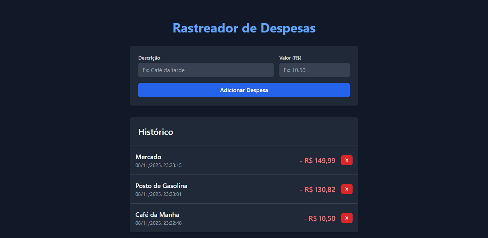

# 💸 Rastreador de Despesas Simples v1.0


Um aplicativo web full-stack moderno e responsivo para rastreamento de despesas pessoais, construído com Next.js, Tailwind CSS, e Vercel Postgres.

Este projeto foi desenvolvido como um aplicativo de portifólio para demonstrar habilidades em desenvolvimento full-stack, interações de banco de dados (CRUD) e boas práticas de engenharia de software.

🌐 **[Acesse o Deploy do projeto aqui](https://rastreador-de-despesas-wheat.vercel.app/)**



--- 

## ✨ Funcionalidades Principais (v1.0)

* **Create (Criar):** Adicionar novas despesas (descrição e valor) através de um formulário.
* **Read (Ler):** Visualizar a lista de todas as despesas registradas, ordenadas das mais recentes para as mais antigas.
* **Delete (Deletar):** Remover despesas com um único clique.
* **Persistência de Dados:** As despesas são salvas e recuperadas de um banco de dados Postgres serveless.
* **Backend com API Routes:** Toda a lógica CRUD é gerenciada por API Routles do Next.js.
* **Designer responsivo:** UI limpa e totalmente funcional em desktops, tablets e celulares.

---

## 🗺️ Roadmap (Próximos passos)

Esta é a versão **v1.0** do projeto, focada em estabelecer o fluxo CRUD principal. As seguintes funcionalidades estão planejadas para futuras atualizações:

* **[ ] v1.1: Funcionalidade de Update (Editar):** Implementar a capacidade de editar o valor e a descrição de uma despesa existente.
* **[ ] v2.0: Autenticação de Usuários:** Adicionar login (provavelmente com NextAuth.js) para que cada usuário tenha sua própria lista de despesas.
* **[ ] v2.1: Dashboard com gráficos:** Criar um resumo visual das despesas por categoria ou data.

---

## 🛠️ Tecnologias Utilizadas

Este projeto foi construído utilizando as seguintes tecnologias:

* **Framework:** [Next.js](https://nextjs.org/) (Pages Router)
* **Estilização:** [Tailwind CSS](https://tailwindcss.com/)
* **Backend:** [Next.js API Routes](https://nextjs.org/docs/pages/building-your-application/routing/api-routes) (Serverless)
* **Banco de Dados:** [Vercel Postgres](https://vercel.com/storage/postgres) (SDK `@vercel/postgres`)
* **Linguagem:** JavaScript (ES6+)
* **Deploy:** [Vercel](https://vercel.com/)

## 🚀 Como Executar o Projeto Localmente

Siga os passos abaixo para rodar o projeto em sua máquina local.

### Pré-requisitos

* [Node.js](https://nodejs.org/en/) (Versão 18.x ou superior)
* [Git](https://git-scm.com/)
* Acesso a um banco de dados Postgres (ex: [Vercel Postgres](https://vercel.com/dashboard/stores))

### Passos

1.  **Clone o repositório:**
    ```bash
    git clone [https://github.com/almeida89/rastreador-de-despesas.git](https://github.com/almeida89/rastreador-de-despesas.git)
    ```

2.  **Navegue até a pasta do projeto:**
    ```bash
    cd rastreador-de-despesas
    ```

3.  **Instale as dependências:**
    ```bash
    npm install
    ```

4.  **Configure as Variáveis de Ambiente:**
    * Crie seu banco de dados no painel da Vercel.
    * Na raiz do projeto, crie um arquivo `.env.local`.
    * Copie e cole as variáveis de ambiente (como `POSTGRES_URL=...`) fornecidas pela Vercel dentro deste arquivo.

5.  **Crie a Tabela no Banco de Dados:**
    * Acesse o "Query Editor" do seu banco de dados no painel da Vercel (ou Neon).
    * Execute o seguinte script SQL:
    ```sql
    CREATE TABLE expenses (
      id SERIAL PRIMARY KEY,
      description VARCHAR(255) NOT NULL,
      amount INT NOT NULL,
      created_at TIMESTAMP DEFAULT CURRENT_TIMESTAMP
    );
    ```

6.  **Inicie o servidor de desenvolvimento:**
    ```bash
    npm run dev
    ```

7.  Abra [http://localhost:3000](http://localhost:3000) no seu navegador para ver a aplicação funcionando!

## 🌐 Deploy na Vercel

Este projeto está 100% otimizado para deploy na [Vercel](https://vercel.com/).

O processo é "zero-config":
1.  Envie seu código para o seu repositório no GitHub.
2.  Crie uma conta na Vercel e importe o repositório.
3.  **Conecte o Vercel Postgres:** Antes do deploy, vá na aba "Storage" e conecte o banco de dados que você criou. A Vercel injetará as variáveis de ambiente automaticamente.
4.  Clique em **"Deploy"**.

## 📄 Licença

Este projeto está licenciado sob a **Licença MIT**. Veja o arquivo [LICENSE](./LICENSE) para mais detalhes.


